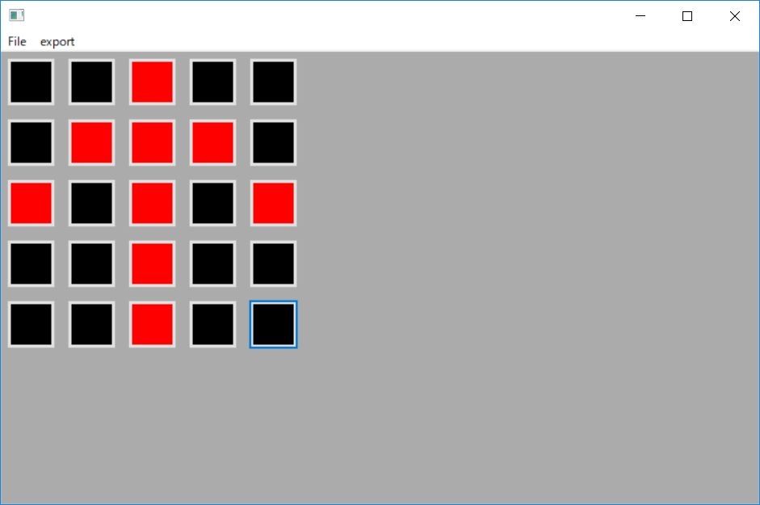

# microbitAnim

"Microbit Anim" is a tool that create scroll animation python code. 

# How to Use
1. Download https://wxpython.org/
2. git clone and open "microbitAnim" folder on Visual Sutudio Code.
3. Run Debug.
4. Create a image.
5. Click "Export -> Python" menu, and save Python code.


```python
from microbit import *
anim00 = Image("00600:06660:60606:00600:00600")
anim01 = Image("00000:00600:06660:60606:00600")
anim02 = Image("00000:00000:00600:06660:60606")
anim03 = Image("00000:00000:00000:00600:06660")
anim04 = Image("00000:00000:00000:00000:00600")
anim05 = Image("00000:00000:00000:00000:00000")
anim06 = Image("00600:00000:00000:00000:00000")
anim07 = Image("00600:00600:00000:00000:00000")
anim08 = Image("60606:00600:00600:00000:00000")
anim09 = Image("06660:60606:00600:00600:00000")
anim = [
    anim00, anim01, anim02, anim03, anim04, anim05, anim06,
    anim07, anim08, anim09]
while True:
    display.show(anim, delay=200)
```
